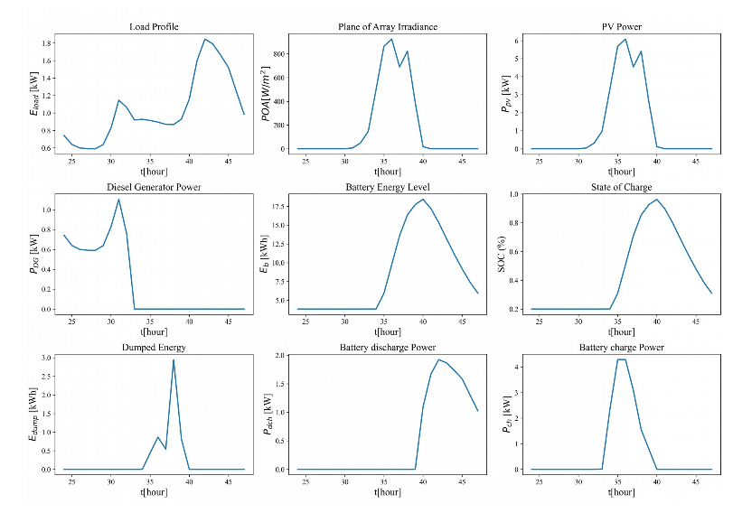
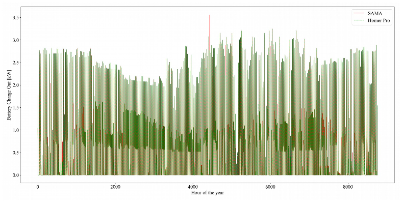

# Docs

Welcome to the documentation for SAMA! Please changet these to actual docs ASAP - this was mainly filled here for testing with the website.

## About

SAMA (Solar Alone Multi-objective Advisor) is an open-source (GNU GPL v3) energy system optimizer and analyzer mainly concentrated on stand-alone off-grid solar photovoltaic (PV)-based renewable energy systems (RES). SAMA allows for hybrid systems in locations that need a form of non-battery backup generation. Using SAMA, users can find the optimum size of a hybrid energy system for their property based on the electric load profile and meteorological data (irradiation, temperature and wind speed). Users are able to access economic data for their optimum energy system as the results of SAMA optimization and calculations. SAMA is developed in Python 3.9 using the NumPy, Numba, time, pandas, math, matplotlib and seaborn.

## Example Output

